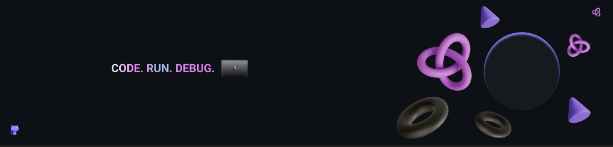

## Hi there 👋!

I'm a full-stack developer with a passion for building robust and scalable backend systems.  While I'm comfortable across the stack, my focus lies in crafting clean and efficient code to power web applications.  Feel free to explore my projects and get in touch! 

email: **jolanutan@gmail.com**  
frontendmentor: [tan911](https://www.frontendmentor.io/profile/tan911)

### 💻 Technologies I used

### ⚛ Frameworks and Libraries I used

### 🛠 Tools I used

